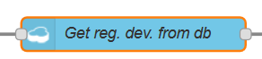
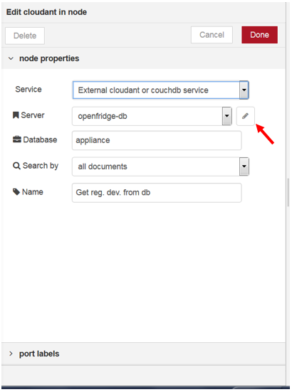
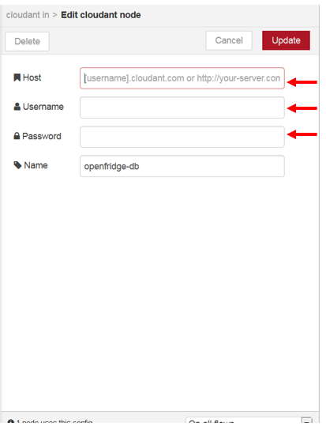
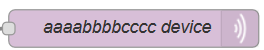
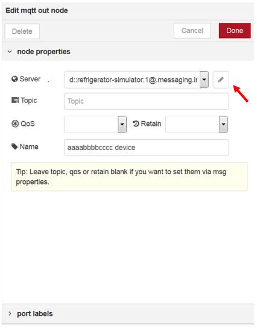
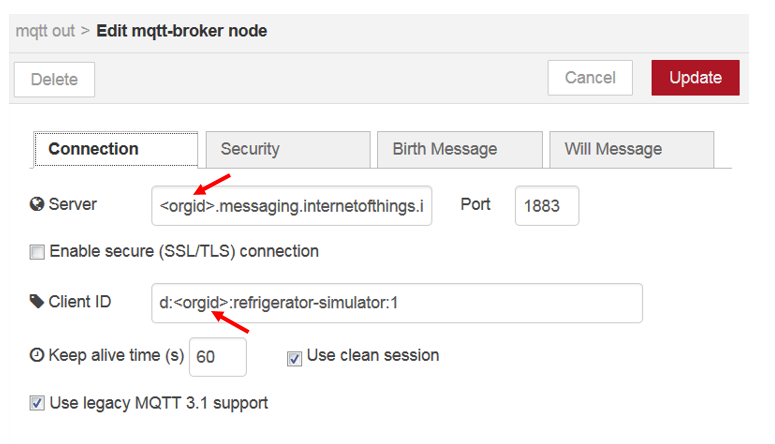
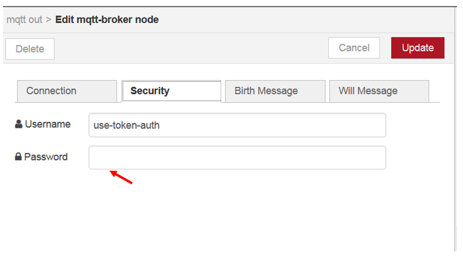
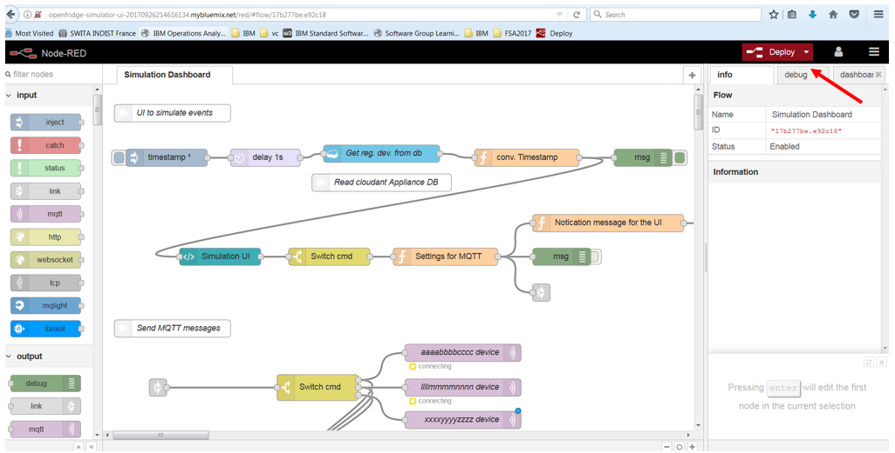
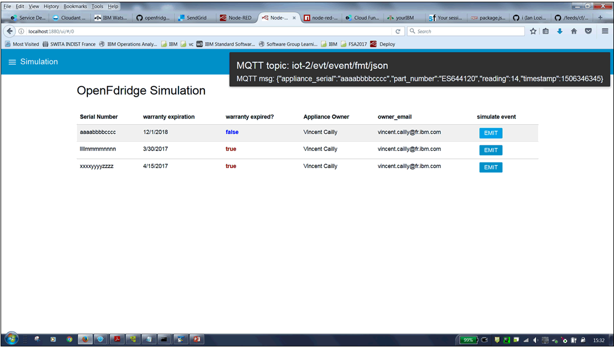

# Openfridge UI (Node-RED Application)

This repository is an Node-RED application to simulate events from virtual appliances of the [openfridge](https://github.com/IBM/openfridge)  sample application.
With this Node-RED application you do not need to use the Paho or Mosquitto MQTT client for simulating events from the virtual devices, you can just do it from a web application.

It  can be deployed into Bluemix with only a couple of clicks, using a Bluemix DevOps Toolchain

# Prerequisites

### **_1- Deploy the openfridge sample Application_**

Follow the instructions provided at :

1. [Set up the Bluemix services (Cloudant, SendGrid, Watson IoT, and a Cloud Foundry app)](https://github.com/IBM/openfridge/blob/master/docs/BLUEMIX.md).
2. [Set up the OpenWhisk actions, triggers, and rules](https://github.com/IBM/openfridge/blob/master/docs/OPENWHISK.md).


#### **_2- Once the openfridge sample Application deployed - update records for each device in  the CLOUDANT_APPLIANCE_DATABASE database of the Openfridge application_**

For each device you need to add a `deviceId `attribute wich contains the device ID  of the appliance (as defined on the IBM IoT platform)

```json
{
  "_id": "aaaabbbbcccc",
  "deviceId": "1",
  "serial": "aaaabbbbcccc",
  "warranty_expiration": 1467259200,
  "owner_name": "Vincent Cailly",
  "owner_email": "vcailly@example.com",
  "owner_phone": "18885551212"
}
```

**Important**: the email address specified here will be eventually used to receive email notifications by the OpenWhisk actions - make sure it is valid.

#### **_3- Create a Cloudant instance for Node-RED_**

From the bluemix console or using the Bluemix CLI, create an instance of the Cloudant 
service, and call it `sample-node-red-cloudantNoSQLDB`. This is where your Node-RED 
instance will store its data.

**Remark:** If you want to change the name of this Cloudant instance, you must  update  `manifest.yml` accordingly.

# Deployment into Bluemix, using a Bluemix DevOps Toolchain

You can easily deploy into bluemix by clicking on the following button.


[](https://bluemix.net/deploy?repository=https://github.com/vcailly/openfridge-simulator-ui.git)

### How does this work?

When you click the button, you are taken to Bluemix where you get a pick a name
for your application at which point the platform takes over, grabs the code from
this repository and gets it deployed.

When you first access the application, you'll be asked to set some security options
to ensure your flow editor remains secure from unauthorised access.

**Important**: Do not check the option to enable Application Metrics for Node.js

# Configuration of the Node-Red flow with your own seetings from the Node-RED flow editor
Once the  `Openfridge UI` application deployed into bluemix you need to configure the `cloudant IN` an the 3 `MQTT OUT` nodes with your own settings  (server and credentials parameters for authentication to the cloudand and IoT platform services)

### For the `cloudant IN` node 

**_1 - Open the `cloudant IN` nodeb_**

_**

**_2 - Click the Edit button of the `Server` attribute_**



**_3 - Fill the fields with the credentials for the `CLOUDANT_APPLIANCE_DATABASE` database of the Openfridge application. Then click on `UPDATE` and then `DONE`.

_**
   
    
### For the `MQTT OUT` nodes (must be done for each of the 3 `MQTT OUT` node

**_1 - Open the `MQTT OUT` node_**



**_2 - Click the Edit button of the `Server` attribute_**



**_3 - On the `Connection`  Tab, Replace  \<orgid\> by the value of your IBM IoT Platform Organization ID_**



**_4 - On the `Security Tab`_**

* Fill the Username Fiels field with the **use-token-auth** value (Authentication to the IBM IoT platform with a Tokeb)

* Fill the Password field with the TOKEN of the Device (That you have set on the IBM IoT platform). Then click on `UPDATE` and then `DONE`.




# Deploy the Node-Red flow with the new settings



# Use the "Openfridge UI"  Application

The Node-Red flow editor is accessible at : http://\<bluemix_app_name\>.mybluemix.net/red/

The "Openfridge UI"  Application is accessible at :http://\<bluemix_app_name\>.mybluemix.net/ui/



